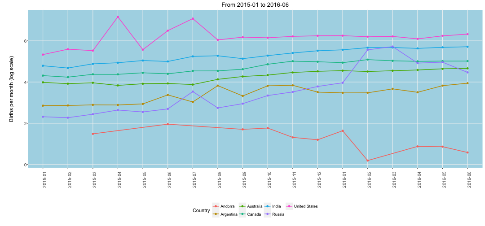

## Introduction

A long time ago ...

Mankind sent a space ship to a galaxy far far away to a planet called Utopia
named after a village on planet earth.

Decades later people have colonised across this planet and find different
areas to cultivate and live in. These slides provide statistical information about how the population
has developed in key areas between January 2015 and June 2016 and what the current trends are.

The [Shiny application](https://bjoernsteffens.shinyapps.io/Project/) allows you to explore all available regions on planet Utopia individually or compare with other regions not presented here.

--- .class #id

## Total Births in key Regions


```
## Andorra, Argentina, Australia, Canada, India, Russia, United States
```


--- .class #id

## Birth Trends in key Regions


```
## Andorra, Argentina, Australia, Canada, India, Russia, United States
```


--- .class #id

## Historical Birth Numbers in key Regions


```
## Andorra, Argentina, Australia, Canada, India, Russia, United States
```


